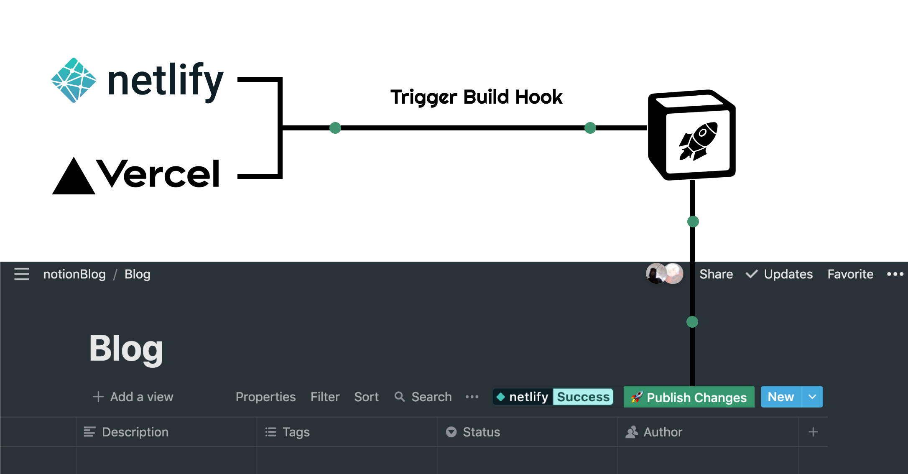
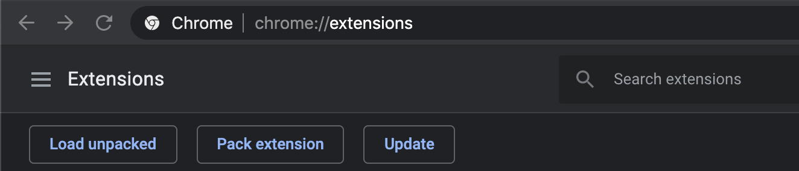
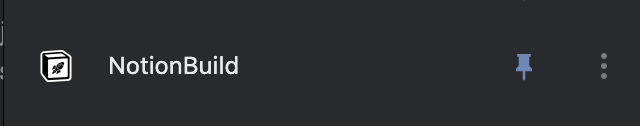
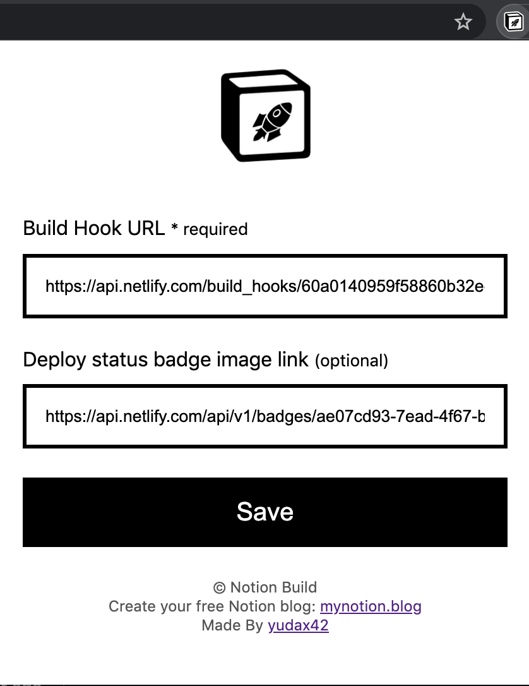
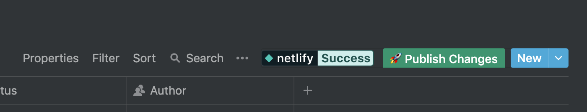

# Notion Build

### An extension that injects a button in Notion.so to Trigger Netlify - Vercel Build hook

## How to Use it 

### 1 - Clone this repository
### 2 - Open `chrome://extensions/`
### 3 - Click `Load Unpacked` and upload the extension directory

### 4 - Pin 

### 5 - Open the extension and fill the inputs (build Hook Url and badge Status link)

### 6 - Open Notion you will notice the `publish changes` button injected and badge status in any database page 

**To inject the button in specific database you need to change `"matches"` property to the link you want in `manifest.json` file**